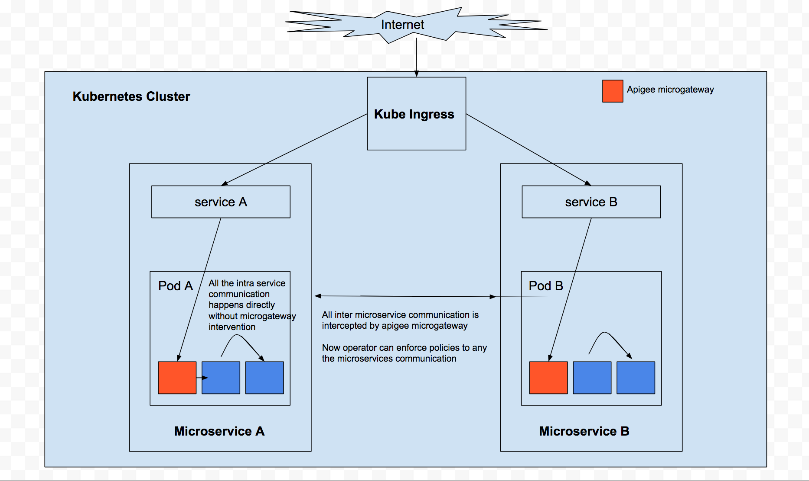

# Apigee Microgateway-Kubernetes-Demo
A microservice story with Apigee microgateway on kubernetes

## Architecture


## Setup

#### Pre-requisites 
- A kubernetes cluster
- Configure kubectl to talk to your kubernetes cluster
- Apigee Org
- node.js
- npm

#### Configuration

For Apigee microgateway to run on kubernetes we need two set of informations
- Org details with credentials(eg: orgname, env, username, password)
- Microgateway configuration(eg: max_connections, log level, plugins)


We will use **Kubernetes secrets** to store Org details and attach it to your microservice during deploy time. 

You can have different secrets for each Apigee environment in your kube namespace. This provides you flexibility to select right Apigee Environment for your microservice during deploy time. As result of which you can have apigee prod/test env setup for your microservice in kube cluster.


We will use **Kubernetes configmap** to store Microgateway configuration and attach it to your microservice during deploy time. 

You can have multiple configmap in your kube namespace. This provide you flexibility to categorize your microservices into logical groups having similar microgateway configuration.


Run the following commands to create a secret for your org/env pair and to create a configmap with default microgateway configuration

------
Before running this command please update the ```artifacts/kube/secrets/cred.txt``` with right credentials.
```
kubectl create secret generic apigee-microgateway-orgname-env-cred --from-file=artifacts/kube/secrets/cred.txt
```
Before running this command please have a look at ``` artifacts/kube/config_maps/apigee-microgateway-default-config.yaml``` 
```
kubectl create -f artifacts/kube/config_maps/apigee-microgateway-default-config.yaml
```

#### Demo

Let's try deploy a simple helloworld microservice and add API management using Apigee microgateway.
```
apiVersion: v1
kind: Pod
metadata:
  name: microservice-helloworld
  labels:
    app: microservice-helloworld
spec:
  restartPolicy: Never
  containers:
  - name: helloworld
    image: tutum/hello-world
    ports:
      - containerPort: 80
```

This is a simple helloworld microservice which if I deploy as it is, will allow me to hit port 80 and return "helloworld" in response.

Instead I will inject Apigee microgateway to this microservice like bellow and try using API managment for this helloworld microservice.

```
apiVersion: v1
kind: Pod
metadata:
  name: microservice-helloworld
  labels:
    app: microservice-helloworld
spec:
  restartPolicy: Never
  containers:
  - name: helloworld
    image: tutum/hello-world
    ports:
      - containerPort: 80

  - name: microgateway
    image: gcr.io/cloud-gravity-161010/kube-microgateway
    imagePullPolicy: Always
    ports:
      - containerPort: 8000
    volumeMounts:
    - name: apigee-microgateway-cred
      mountPath: /opt/apigee/microgateway/cred
      readOnly: true
    - name: apigee-microgateway-default-config
      mountPath: /root/.edgemicro/configmap

  volumes:
  - name: apigee-microgateway-cred
    secret:
      secretName: apigee-microgateway-bumblebee-test-cred
  - name: apigee-microgateway-default-config
    configMap:
      name: apigee-microgateway-default-config
```

Notice that I have attached two volumes to the POD, which are basically the configuration for Apigee mirogateway to run.

Let's goahead and deploy helloworld proxy on your Apigee Organization in the right you specified in the kube secret that is attached to your helloworld microservice.

Follow the instructions bellow - 
- goto https://apigee.com/api-management 
- goto develop-> API proxies
- click on create proxy
- select reverse proxy 
- enter a proxy name: helloworld
- enter http://localhost in 'Existing API' section, since microgateway and helloworld container are running in same POD they can communicate over local network interface.
- select pass through authorization
- select right environment where you want to deploy the proxy(same environment which you mentioned in the secret)
- click next next next to create the proxy


Lets deploy this microservice. Run the bellow command
```
cd setup
```
```
./create_helloworld.sh
```

This will create and kube service and kube POD for your microservice.

Now your microservice is protected by Apigee microgateway. Microgateway will pull the proxies configured for that environment.


Lets hit this microservice and see a glimps of API managment in action.

Get the IP address of you hello-world microservice
```
kubectl describe svc microservice-helloworld
```

Make calls
```
curl <ip>
```

You should be see Authorization failures

TODO: get apikey and run successful calls
